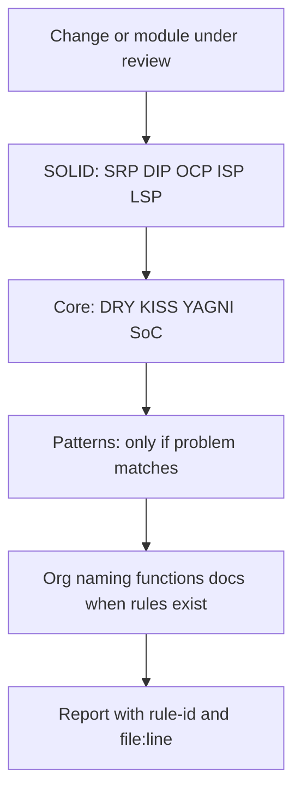

# Clean Code Principles

**Language-agnostic design guidance for maintainable software** — SOLID, DRY, KISS, YAGNI, and proven patterns. Each rule is a short document with anti-patterns, good examples, and when to apply it.

| | |
| --- | --- |
| **Version** | 1.0.2 |
| **Rules shipped** | 23 (10 SOLID · 12 core · 1 pattern) |
| **Categories** | 7 total (3 implemented, 4 planned) |
| **Examples** | TypeScript (concepts apply broadly) |
| **License** | [MIT](https://opensource.org/licenses/MIT) |
| **Upstream** | [AsyrafHussin/agent-skills](https://github.com/AsyrafHussin/agent-skills) (vendored in this repo) |

---

## Table of contents

- [Why this skill exists](#why-this-skill-exists)
- [In Project Vitalis](#in-project-vitalis)
- [How to use it](#how-to-use-it)
- [Review workflow](#review-workflow)
- [Rule catalog](#rule-catalog)
- [SOLID at a glance](#solid-at-a-glance)
- [Core principles at a glance](#core-principles-at-a-glance)
- [Reporting findings](#reporting-findings)
- [Skill layout](#skill-layout)
- [Roadmap](#roadmap)
- [Further reading](#further-reading)

---

## Why this skill exists

Software quality is not a single checklist — it is a **priority stack**. Architectural mistakes (wrong boundaries, hidden coupling, duplicated domain knowledge) cost more to fix than naming or comment nits. This skill encodes that stack:

1. **SOLID** — structure classes, modules, and dependencies so change stays local.
2. **Core principles** — daily habits: one source of truth, simple solutions, no speculative abstractions.
3. **Patterns** — named solutions when the problem genuinely recurs (not because patterns are fashionable).

Agents load [`SKILL.md`](SKILL.md) during work. Humans browse **this README** for the map, then open individual rules under [`rules/`](rules/) for depth.

---

## In Project Vitalis

This skill is **general**; store-specific boundaries live elsewhere. Use it together with:

| Document | Role |
| --- | --- |
| [`ARCHITECTURE.md`](../../../ARCHITECTURE.md) | Decisions: one Worker, feature modules, stock/money rules |
| [`vitalis-conventions`](../vitalis-conventions/SKILL.md) | Bindings for routes, Drizzle, centavos, variants, client data |
| [`AGENTS.md`](../../../AGENTS.md) | When agents must invoke which skills |

**Examples of overlap (not duplication):**

- **DIP + ports** — Payments depends on a Mercado Pago port; tests inject fakes (`solid-dip-injection`, `solid-dip-abstractions`, `pattern-repository`).
- **SRP** — Routes do not contain SQL; SQL does not call Mercado Pago (`solid-srp-class`, `core-separation-concerns`).
- **YAGNI** — No generic “framework inside the framework” until a second consumer exists (`core-yagni-abstractions`).

When reviewing Vitalis code, apply **vitalis-conventions first**, then use this skill for structural and quality arguments the conventions do not spell out.

---

## How to use it

### For developers

1. Pick a **category** below matching your task (new feature → SOLID + separation; duplication → DRY; “clever” refactor → KISS/YAGNI).
2. Open the linked rule file; compare your change to the **Bad** / **Good** sections.
3. In code review, cite **`rule-id`** so others can look up the same guidance.

### For agents

| Need | Start here |
| --- | --- |
| Entry point / triggers | [`SKILL.md`](SKILL.md) |
| Strategies, examples, prioritization | [`AGENTS.md`](AGENTS.md) |
| Category definitions | [`rules/_sections.md`](rules/_sections.md) |
| New rule template | [`rules/_template.md`](rules/_template.md) |

**Trigger phrases:** “review architecture”, “check code quality”, “SOLID principles”, “design patterns”, “clean code”, “refactoring advice”, “code smells”, “DRY”, “separation of concerns”.

---

## Review workflow

Use this order so critical issues surface before style debates:



**Priorities:** CRITICAL (SOLID, core) → HIGH (patterns, future `org-`) → MEDIUM (`name-`, `func-`) → LOW (`doc-`).

---

## Rule catalog

### SOLID principles (critical)

| Rule ID | Title | Rule file |
| --- | --- | --- |
| `solid-srp-class` | Single Responsibility (class) | [solid-srp-class.md](rules/solid-srp-class.md) |
| `solid-srp-function` | Single Responsibility (function) | [solid-srp-function.md](rules/solid-srp-function.md) |
| `solid-ocp-extension` | Open/Closed (extension) | [solid-ocp-extension.md](rules/solid-ocp-extension.md) |
| `solid-ocp-abstraction` | Open/Closed (abstraction) | [solid-ocp-abstraction.md](rules/solid-ocp-abstraction.md) |
| `solid-lsp-contracts` | Liskov Substitution (contracts) | [solid-lsp-contracts.md](rules/solid-lsp-contracts.md) |
| `solid-lsp-preconditions` | Liskov Substitution (pre/postconditions) | [solid-lsp-preconditions.md](rules/solid-lsp-preconditions.md) |
| `solid-isp-clients` | Interface Segregation (client-specific) | [solid-isp-clients.md](rules/solid-isp-clients.md) |
| `solid-isp-interfaces` | Interface Segregation (small interfaces) | [solid-isp-interfaces.md](rules/solid-isp-interfaces.md) |
| `solid-dip-abstractions` | Dependency Inversion (abstractions) | [solid-dip-abstractions.md](rules/solid-dip-abstractions.md) |
| `solid-dip-injection` | Dependency Inversion (injection) | [solid-dip-injection.md](rules/solid-dip-injection.md) |

### Core principles (critical)

| Rule ID | Title | Rule file |
| --- | --- | --- |
| `core-dry` | Don't Repeat Yourself | [core-dry.md](rules/core-dry.md) |
| `core-dry-extraction` | DRY — extraction | [core-dry-extraction.md](rules/core-dry-extraction.md) |
| `core-dry-single-source` | DRY — single source of truth | [core-dry-single-source.md](rules/core-dry-single-source.md) |
| `core-kiss-simplicity` | KISS — simplicity | [core-kiss-simplicity.md](rules/core-kiss-simplicity.md) |
| `core-kiss-readability` | KISS — readability | [core-kiss-readability.md](rules/core-kiss-readability.md) |
| `core-yagni-features` | YAGNI — features | [core-yagni-features.md](rules/core-yagni-features.md) |
| `core-yagni-abstractions` | YAGNI — abstractions | [core-yagni-abstractions.md](rules/core-yagni-abstractions.md) |
| `core-separation-concerns` | Separation of concerns | [core-separation-concerns.md](rules/core-separation-concerns.md) |
| `core-composition` | Composition over inheritance | [core-composition.md](rules/core-composition.md) |
| `core-law-demeter` | Law of Demeter | [core-law-demeter.md](rules/core-law-demeter.md) |
| `core-fail-fast` | Fail fast | [core-fail-fast.md](rules/core-fail-fast.md) |
| `core-encapsulation` | Encapsulation | [core-encapsulation.md](rules/core-encapsulation.md) |

### Design patterns (high)

| Rule ID | Title | Rule file |
| --- | --- | --- |
| `pattern-repository` | Repository (data access) | [pattern-repository.md](rules/pattern-repository.md) |

---

## SOLID at a glance

| Letter | Idea | Rule IDs |
| --- | --- | --- |
| **S** | One reason to change per class or function | `solid-srp-class`, `solid-srp-function` |
| **O** | Extend behavior without editing stable code | `solid-ocp-extension`, `solid-ocp-abstraction` |
| **L** | Subtypes honor the contract of the base type | `solid-lsp-contracts`, `solid-lsp-preconditions` |
| **I** | Small interfaces; clients do not depend on unused methods | `solid-isp-clients`, `solid-isp-interfaces` |
| **D** | Depend on abstractions; inject implementations | `solid-dip-abstractions`, `solid-dip-injection` |

```typescript
// Illustration: SRP + DIP (see rule files for full bad/good pairs)
class OrderService {
  constructor(
    private readonly orders: OrderRepository,
    private readonly payments: PaymentsPort,
  ) {}

  async checkout(input: CheckoutInput) {
    const order = await this.orders.create(input);
    return this.payments.createSpeiTransfer({ orderId: order.id, /* … */ });
  }
}
```

---

## Core principles at a glance

| Principle | Meaning | Rule IDs |
| --- | --- | --- |
| **DRY** | One authoritative representation of each piece of knowledge | `core-dry`, `core-dry-extraction`, `core-dry-single-source` |
| **KISS** | Simplest design that satisfies the requirement | `core-kiss-simplicity`, `core-kiss-readability` |
| **YAGNI** | Build what you need now, not what you might need later | `core-yagni-features`, `core-yagni-abstractions` |

Supporting rules: `core-separation-concerns`, `core-composition`, `core-law-demeter`, `core-fail-fast`, `core-encapsulation`.

---

## Reporting findings

Use a consistent, grep-friendly line format:

```text
file:line - [rule-id] Short description of the issue
```

**Example**

```text
src/worker/features/orders/service.ts:42 - [solid-srp-class] Service validates, persists, and sends mail in one class
src/shared/validators.ts:18 - [core-dry] Email check duplicated from src/web/lib/validation.ts
src/worker/features/payments/stub.ts:7 - [core-yagni-abstractions] Generic gateway wrapper used in one call site
```

In reviews, group by **priority**, then by file. Prefer a few high-impact citations over a long list of minor nits.

---

## Skill layout

```text
clean-code-principles/
├── README.md          ← You are here (human-facing map)
├── SKILL.md           ← Agent entry: triggers, categories, summaries
├── AGENTS.md          ← Agent playbook: strategies and examples
└── rules/
    ├── _sections.md   ← Category priorities and naming
    ├── _template.md   ← Authoring new rules
    ├── solid-*.md     ← 10 SOLID rules
    ├── core-*.md      ← 12 core rules
    └── pattern-*.md   ← Pattern rules (repository today)
```

**Naming convention:** `{prefix}-{concept}-{specificity}.md` (example: `core-dry-extraction`).

---

## Roadmap

Planned rule prefixes (not yet in the repo):

| Priority | Prefix | Focus |
| --- | --- | --- |
| HIGH | `org-` | Feature folders, module boundaries, layering, circular deps |
| MEDIUM | `name-` | Intention-revealing names, domain language, no magic literals |
| MEDIUM | `func-` | Small functions, few parameters, command/query split |
| LOW | `doc-` | Self-documenting code, “why” comments, public API docs |

Additional patterns (factory, strategy, observer, etc.) are listed in [`SKILL.md`](SKILL.md) as planned; only **repository** is implemented today.

---

## Further reading

### Books

- *Clean Code* — Robert C. Martin
- *Design Patterns* — Gang of Four
- *Refactoring* — Martin Fowler
- *The Pragmatic Programmer* — Hunt & Thomas

### Online

- [Refactoring Guru](https://refactoring.guru/) — Patterns and code smells
- [Martin Fowler’s refactoring catalog](https://refactoring.com/catalog/)
- [Uncle Bob’s blog](https://blog.cleancoder.com/) — Craftsmanship essays

---

## License

MIT — see upstream [AsyrafHussin/agent-skills](https://github.com/AsyrafHussin/agent-skills). Vendored copy in Project Vitalis; track updates via [`.agents/skills/MANIFEST.md`](../MANIFEST.md) and [`skills-lock.json`](../../../skills-lock.json).
