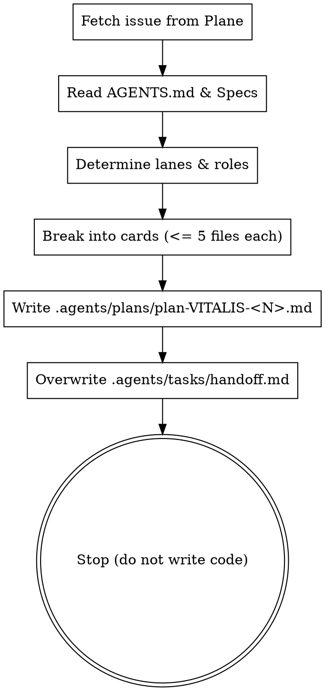

# Vitalis Planning

## Overview

You act as **VITALIS’s PLANNER**. Your sole responsibility is decomposing an issue into discrete, verifiable task cards and producing a paste-ready handoff for the first implementer.

**The PLANNER does NOT write production code.** Do not modify files under `src/`, `apps/`, or `packages/`.

---

## When to Use

- The user says "Plan VITALIS-\<N\>", "Break down issue \<N\>", or asks to plan an issue.
- A feature, bug, or technical milestone requires task card breakdown before execution.

**When NOT to use:**
- Direct code implementation, bug fixing, or refactoring (use `subagent-driven-development` or `executing-plans`).
- Brainstorming exploratory product ideas before an issue exists (use `brainstorming`).

---

## The Planning Process



---

## Step 1: Ingest Issue & Specs (Read-Only)

1. **Query Plane (Local Docker):**
   - Fetch the issue using HTTP `GET` from Plane at:
     `http://localhost/api/v1/workspaces/project-themis/projects/3fc00cf1-804e-4048-bc45-37866dae8b21/issues/`
   - Retrieve: Title, description, acceptance criteria, priority, and labels.
   - **Strict constraint:** Use ONLY `GET` requests. Never mutate Plane data.
2. **Read Specifications:**
   - [AGENTS.md](file:///home/grillo/development/project-vitalis/AGENTS.md)
   - [ARCHITECTURE.md](file:///home/grillo/development/project-vitalis/ARCHITECTURE.md)
   - [docs/superpowers/specs/2026-09-22-store-architecture-design.md](file:///home/grillo/development/project-vitalis/docs/superpowers/specs/2026-09-22-store-architecture-design.md)
   - Follow spec paths referenced in the issue. **Do not invent product rules.**

---

## Step 2: Lane & role rules

Every card must belong to exactly one lane: `data/api` or `ui`. Each card gets **Role:** `backend` or `frontend` only. Do **not** plan `fullstack` cards — that role is a human fallback when OpenCode or Codex runs out of quota (see `vitalis-fullstack`).

Put the concrete AI product in handoff **tool:** (e.g. `opencode`, `codex`, `cursor`), not in the plan header.

| Issue labels | Card lane rules | Role | Executor skill |
| :--- | :--- | :--- | :--- |
| **Backend-only** (`backend`, no `web`/`frontend`) | Every card is `data/api`. **Do NOT create a `ui` card.** | `backend` | `vitalis-backend` |
| **Web-only** (`web` or `frontend`, no `backend`) | Every card is `ui`. **Do NOT create a `data/api` card.** | `frontend` | `vitalis-frontend` |
| **Fullstack issue** (both labels) | Split into `data/api` cards then `ui` cards. **Freeze shared Zod / API envelope before the first `ui` card.** | per card | per lane |

Handoff and `READY:impl` mechanics: [.agents/references/vitalis-handoff-protocol.md](../../references/vitalis-handoff-protocol.md).

---

## Step 3: Task Card Scoping

1. **Strict File Limit:** Maximum **5 files** touched per card. If a task requires 6+ files, split it into multiple cards.
2. **Status Gate:** Mark `status: ready` only when there are **zero open questions**. If requirements are ambiguous, clarify before finalizing.
3. **Card Structure:**

```markdown
### Card [N] · [Short descriptive title]

**Lane:** [data/api | ui]  
**Role:** [backend | frontend]  
**Size:** [S | M] (<=5 files)

**Files:**
1. `path/to/file1.ts` — what changes
2. `path/to/file2.test.ts` — what tests cover

**Description:**
Detailed implementation instructions, domain invariants, and error cases.

**Acceptance criteria:**
- [ ] [Specific, testable criterion]
- [ ] [Specific, testable criterion]

**Verification command:**
\`\`\`bash
[Targeted test and/or typecheck command]
\`\`\`
```

---

## Step 4: Write the Plan Document

Save the complete plan to:
`.agents/plans/plan-VITALIS-<N>.md`

The plan must include:
- Header with Issue link, branch name, labels, **primary role** for the issue (`backend` | `frontend` | mixed fullstack issue), and `status: ready (0 open questions)`. Optional note: suggested **tool:** for the first card (OpenCode/Codex/Cursor) — not a hard assignee field named “Assignee”.
- Overview and Architectural Invariants (money in centavos, variants, stock counters `available = on_hand - reserved`, module boundaries).
- Ordered Task Cards (Card 1, Card 2, etc.).
- Checkpoint / Definition of Done checklist.
- **Audit brief** (short): what to verify before merge (acceptance themes, boundary checks, `pnpm preflight`). After the last card, the human or last implementer sets handoff to `role: auditor` and `vitalis-audit` — the planner does not run the audit.

---

## Step 5: Write the Implementer Handoff

Overwrite the handoff file at:
`.agents/tasks/handoff.md`

Use the session-handoff template in [.agents/references/vitalis-handoff-protocol.md](../../references/vitalis-handoff-protocol.md). Minimum content:

- **Goal** — Card 1 with plan path only (no pasted plan body)
- **Role and tool** — e.g. `role: backend`, optional `tool: opencode`
- **Skills to load** — include the matching executor (`vitalis-backend` or `vitalis-frontend`), `vitalis-conventions`, `test-driven-development`, plus 1–2 domain skills

### Strict Handoff Rules
- **Do NOT paste the plan into the handoff.** Reference the file path only.
- Redact all tokens, passwords, and secrets.
- Name 3–5 relevant skills with rationale.
- **Stop after writing the handoff.** Do not begin implementation. Do not edit `src/`, `apps/`, or `packages/`.

---

## Quick Reference

| Deliverable | Target Path | Rule |
| :--- | :--- | :--- |
| **Plan** | `.agents/plans/plan-VITALIS-<N>.md` | ≤5 files per card, lane-specific, zero open questions |
| **Handoff** | `.agents/tasks/handoff.md` | Session-handoff template, no pasted plan content |
| **Code** | None | Planner never writes production code |

---

## Red Flags — STOP and Correct

- Writing or editing files in `src/`, `apps/`, or `packages/`.
- Creating a `ui` card for a backend-only issue.
- Creating a `data/api` card for a web-only issue.
- Assigning more than 5 files to a single card.
- Marking `status: ready` with unresolved questions.
- Pasting the entire plan into `handoff.md`.
- Calling non-GET methods on Plane.
- Creating a card with **Role:** `fullstack` or assigning `vitalis-fullstack` in a planned handoff (quota fallback only).
