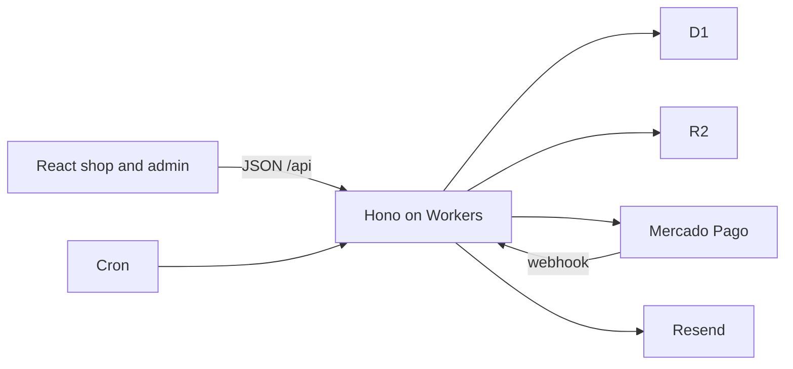

# Architecture

Mexico-only shop for native medicine and products related to Yoruba culture. Spanish UI, prices in MXN, shipments only inside the country. Hosting stays on free tiers. The domain is the only planned cash cost. Mercado Pago charges its own fee when a bank transfer clears.

The behavioral contract, including failure cases and the test list, lives in [docs/superpowers/specs/2026-09-22-store-architecture-design.md](docs/superpowers/specs/2026-09-22-store-architecture-design.md). This file records the decisions.

## Decisions

### 1. One app on Cloudflare

The shop, the admin, the API, and the payment webhook run as one Worker. Vite builds a React app that Cloudflare serves as static assets. Hono handles `/api/*` and the webhook. Data is in D1 through Drizzle. Photos are in R2, on a subdomain of the store domain once it exists.

This stays awake when the shop is quiet, which a payment webhook requires. The free plan allows a commercial store. Vercel’s free Hobby plan does not. Supabase’s free database can pause after a quiet week and drop the webhook.

Consequences: 100,000 dynamic requests a day and 10 milliseconds of CPU each. Static assets are unlimited. The Worker returns JSON. It does not render React and it does not resize images. The browser resizes a photo before upload. Photo views go to R2, not through the Worker.

### 2. The browser never calls vendors directly

Six modules inside Hono are the only writers:

| Module | Owns |
| --- | --- |
| Catalog | Products, variants, categories, prices |
| Stock | Every change to a quantity, each in one transaction |
| Orders | Site checkouts and WhatsApp orders typed by the admin |
| Payments | Creating a SPEI transfer and accepting the webhook |
| Auth | Customer accounts and the admin login |
| Mail | Resend. A failed send does not roll back stock or an order |

Secrets stay in the Worker: Mercado Pago access token and webhook secret, Resend key, Google and Facebook OAuth secrets, and the auth secret.

### 3. Every sellable thing is a variant

A simple product is a product with one variant. The admin hides that until a second presentation is added. Price and stock live on the variant. Prices are stored in centavos and shown in MXN with two decimals. Each product has one category from a list the admin maintains.

An order line stores the unit price agreed at that moment. A later catalog change does not rewrite the order.

### 4. Stock is on hand, reserved, and available

Available is on hand minus reserved. The shop and the admin sell from available only.

The cart does not hold units. Checkout reserves them, in one transaction, for 3 days. Confirming payment removes the units from both counters. Releasing a hold removes them from reserved only. Shipping does not change stock. A manual correction changes on hand, requires a reason, and cannot push on hand below what is already reserved.

A conditional update decides a race. Two checkouts for the last unit produce one reservation. On hand does not go negative.

### 5. Site payment is a SPEI transfer

Checkout creates a Mercado Pago order with `payment_method.id` `clabe` and type `bank_transfer`, `expiration_time` `P3D`, our order id as `external_reference`, and an idempotency key. The customer receives the `ticket_url` (CLABE and reference) on screen and by email.

The webhook is answered immediately. The Worker then fetches the order from Mercado Pago. The notification body is not the source of truth. A repeat notice for an order already `paid`, `expired`, `cancelled`, or `needs_review` does nothing.

A cron every 15 minutes fetches Mercado Pago before releasing an expired hold. If that call fails, the hold stays. A paid notice that arrives after the units were released becomes `needs_review` and does not take stock again.

`needs_review` is resolved by the admin. Dismiss releases any remaining hold and cancels the order. Confirming the sale is allowed only when Mercado Pago reports the transfer paid and available stock still covers every line.

### 6. WhatsApp is a link, and recording the sale is optional

The product button opens `wa.me` with the product name, and the variant name when one is selected. It does not create an order and it does not touch stock.

The admin may type that sale into the order list at the agreed prices. Saving it marks the order paid and reduces on hand immediately, only from available units. A sale left in the chat never appears in stock or in the paid total.

There is no WhatsApp Business API.

### 7. One shipping price, carrier chosen later

The admin sets one shipping amount for any order inside Mexico. Checkout shows it as its own line. The Mercado Pago total is merchandise plus that amount. The order stores the amount from that moment.

The customer does not see the carrier until the admin marks the order shipped and records the carrier and tracking number. There is no carrier API.

### 8. Guest checkout, with optional customer accounts

Guest checkout is valid. The guest opens the order with an unguessable token that keeps working after payment.

Customer sign-in, when used, is Google (name, email, profile), then Facebook (public profile and email), then verified email and password. The verification link expires after 24 hours. Sign in with Apple stays in the auth module and switched off, because it requires the Apple Developer Program at 99 USD a year.

A verified email attaches earlier guest orders to the account, and links Google, Facebook, and a password when the provider asserts that email. The site has a privacy-policy page and a Facebook data-deletion URL. That URL deletes the account and detaches it from orders. Order snapshots stay so a shipment can still go out.

### 9. The admin is a username and a password

The admin account is created by us. There is no public signup, no social login, and no password-reset mail. A lost password is reset by us.

The admin opens on a summary of today’s work: orders to ship, transfers still on hold, orders in review, sold-out variants, variants with 1 to 5 available, and the paid total for today and for the month. The paid total counts an order when it becomes paid, including orders later shipped.

### 10. Order status

`pending_payment`, `paid`, `shipped`, `cancelled`, `expired`, `needs_review`.

A site order starts pending. It becomes paid when the transfer is confirmed, then shipped when the carrier is recorded. Cancelling an unshipped order releases a hold or puts paid units back on hand, in one transaction. A shipped order cannot be cancelled through this path.

The buyer snapshot on every order is name, phone, email, and a Mexican address: street, exterior number, neighborhood (colonia), city, state, and postal code.

### 11. Features own their code

The Worker and the web app are organized by feature. A feature holds its routes, schema, service, screens, and queries. Shared folders stay small.

```text
src/worker/features/catalog|stock|orders|payments|auth|mail
src/web/features/shop|cart|checkout|account|admin
src/web/components/ui          shadcn primitives only
src/web/lib/api-client.ts      the ky instance
src/shared                     Zod schemas both sides import
```

`components/ui` holds shadcn primitives and nothing else. The ky file sets the base URL, credentials, and the error hook. Each feature owns its paths and its query options. A screen is composed inside its feature. When shadcn has the piece, the feature uses it. When it does not, the piece is built in that feature and moves to `components/ui` only after a second feature needs the same primitive.

A file is split when it has a second responsibility. That is what keeps a single HTTP module or a single components folder from collecting every screen.

### 12. Client packages, each with one job

| Package | Job |
| --- | --- |
| `@tanstack/react-query` | Every read and write of server data: products, stock, orders, dashboard |
| `ky` | The HTTP client those query functions call |
| `zustand` | Client state: the cart until checkout, and short UI flows such as checkout steps |
| `@tanstack/react-form` | Every form |
| `zod` | The schema for a form and the same schema for the Hono request |
| `@tabler/icons-react` | Every icon |
| shadcn/ui | Every visual component, copied into `components/ui`. Tailwind CSS comes with it |

Server data stays in TanStack Query. Zustand does not cache products, stock, orders, or dashboard figures. The order status lives on the server. The screen reads it back through Query.

Forms use TanStack Form’s `useForm`. The markup is shadcn’s `Field`, `Input`, `Button`, and the other primitives. shadcn documents this pairing. A shadcn component that arrives with a Lucide icon is switched to Tabler before it is used.

### 13. Clean Code and SOLID are the module boundaries

A feature has one reason to change. Routes do not contain SQL. SQL does not call Mercado Pago. A feature exports a small set of functions, and callers depend on those functions. Payments depends on a port so tests can pass a fake Mercado Pago client, which the test plan already requires.

Names come from the domain: reserve, release, confirm. A function does one thing. A small function stays in its feature file. It is not extracted into its own file for ceremony.

## Shape



## Free-tier limits

| Piece | Limit this design stays inside |
| --- | --- |
| Worker | 100,000 dynamic requests a day, 10 ms CPU each. Static assets unlimited. |
| D1 | 500 MB, 5 million row reads and 100,000 row writes a day. Indexed queries, one transaction per checkout, stock change, or payment notice. |
| R2 | 10 GB. Photos resized in the browser. |
| Resend | 100 emails a day, 3,000 a month. A site order sends the ticket link, then a payment confirmation. |
| Cron | One trigger, every 15 minutes. The free plan allows five. |
