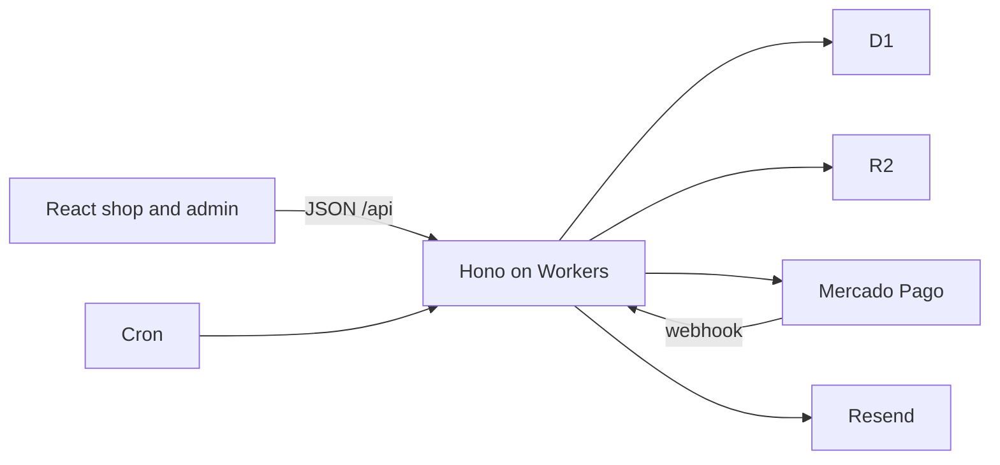

# Store architecture

Decisions are recorded in [ARCHITECTURE.md](../../../ARCHITECTURE.md). This document is the behavioral contract.

Mexico-only shop for native medicine and products related to Yoruba culture. The site is in Spanish. Prices are in MXN. Every shipment stays inside the country. Hosting stays on free tiers. The domain is the only planned cash cost. Mercado Pago charges its own fee when a bank transfer clears.

## Runtime

One Cloudflare Worker serves two surfaces.

Vite builds the shop and the admin into one React app. Cloudflare serves those files as static assets, so a page view does not spend a Worker request. The Worker runs for `/api/*` and for the Mercado Pago webhook. Any other URL returns the app shell, and React handles the route.

The Worker returns JSON. It does not render React, and it does not resize images. The browser resizes a photo before upload. That keeps each dynamic request inside the free plan's 10 millisecond CPU budget.

Data sits in D1 through Drizzle. Product photos sit in R2. Once the domain exists, photo URLs use a subdomain of that domain, so image views stay off the Worker.

Secrets live in the Worker, not in the repo: the Mercado Pago access token and webhook secret, the Resend key, the Google and Facebook OAuth secrets, and the auth secret.

There is no carrier API and no WhatsApp Business API. Shipping is a note on the order. WhatsApp is a `wa.me` link.

## Modules

The browser never talks to D1, R2, Mercado Pago, or Resend. Six modules inside Hono own that work.

- **Catalog** reads and edits products, variants, categories, and prices.
- **Stock** is the only writer of quantities. Reserve, confirm, release, and a manual correction each run in one database transaction.
- **Orders** stores site checkouts and the WhatsApp orders an admin chooses to type in.
- **Payments** is the only code that creates a SPEI transfer and the only code that accepts the webhook.
- **Auth** covers optional customer accounts and a separate admin login.
- **Mail** sends through Resend. A failed send does not roll back stock or an order.

## Data model

Every sellable thing is a variant. A simple product is a product with one variant. The admin hides that detail until a second presentation is added. Price and stock always live on the variant.

A product is the page: name, description, one category, and photos. The admin maintains the category list. A variant is what the customer buys: a name (a default name when it is the only one), a price stored in centavos and shown in MXN with two decimals, an optional photo, and the stock counters.

Stock on a variant is two stored numbers:

- **On hand** is the units still in the shop.
- **Reserved** is the units held for a site order waiting on a bank transfer.
- **Available** is on hand minus reserved. The shop and the admin sell from available only.

A reservation row records the order, the variant, the quantity, and when the hold expires. Confirming a payment removes the units from both reserved and on hand. Releasing a hold removes them from reserved only. Shipping does not change stock.

An order stores its source (`site` or `whatsapp`), a snapshot of the buyer, the lines, and the shipping amount. Each line stores the variant, the quantity, and the unit price agreed at that moment. Catalog prices can change later. The order keeps what was charged.

The buyer snapshot is name, phone, email, and a Mexican address: street, exterior number, neighborhood (colonia), city, state, and postal code. A guest order has no user. A signed-in customer order also points at their account.

Order status is one of: `pending_payment`, `paid`, `shipped`, `cancelled`, `expired`, `needs_review`.

A site order starts as `pending_payment`. It becomes `paid` when Mercado Pago confirms the transfer, then `shipped` when the admin adds a carrier and a tracking number. It becomes `expired` or `cancelled` when the hold is released. `needs_review` means the automatic path stopped: either a payment notice arrived after the units were already released, or a hold could not be released after Mercado Pago rejected the transfer request. Stock is not taken again on its own.

A WhatsApp order is entered already `paid`, at the prices the admin types, and it reduces on hand immediately. There is no hold.

## Customer accounts

Guest checkout stays valid. Customer sign-in is optional, in this order on the screen:

1. **Google**, with the name, email, and profile scopes only.
2. **Facebook**, with public profile and email only. The site includes a privacy-policy page and a data-deletion URL so the Meta app can go live. That URL deletes the customer account and detaches it from orders. Order snapshots stay, so a shipment can still be fulfilled.
3. **Email and a password**, last. Signup sends a verification link through Resend. The link expires after 24 hours. The account cannot sign in until that link is opened.

Sign in with Apple stays in the auth module and switched off. Apple requires the Developer Program at 99 USD a year.

A social login that brings a verified email is already verified. If Facebook returns no email, the customer adds one and verifies it before that account can hold an order history. Google, Facebook, and a password attach to one account when the email matches and the provider asserts that the email is verified. Once an email is verified, earlier guest orders placed with that email attach to the account.

A guest opens the order page with an unguessable token stored on the order, not with the order id. The token keeps working after payment, so the guest can see the paid and shipped states.

## Admin login

The admin signs in with a username and a password. That account is created by us. There is no public admin signup, no social login, and no "forgot password" mail. A lost admin password is reset by us.

## Checkout and stock

The cart in the browser does not hold stock. Units are reserved only when the customer submits checkout.

The transfer total is the merchandise total plus the shipping amount, in MXN. Checkout shows the shipping charge as its own line, with no carrier name. The order stores the shipping amount from that moment.

Checkout runs in one database transaction. For each line, available stock has to cover the quantity. The order is saved as `pending_payment`, with the address and the prices, and those units move into reserved. If one line is short, or the database write fails, nothing is saved and nothing is reserved. The customer is told which product is short.

The payments module then creates a Mercado Pago order for a SPEI transfer (`payment_method.id` `clabe`, type `bank_transfer`) with `expiration_time` of `P3D`. The same instant is stored on the reservation. Our order id is the Mercado Pago `external_reference`, and the create call sends an idempotency key. Mercado Pago returns a `ticket_url` with the CLABE and the reference. The customer sees that page, and Resend sends the same link. The hold lasts 3 days.

When Mercado Pago notifies us, we answer immediately and then fetch the order from Mercado Pago. The notification body is not the source of truth. A repeat notice for an order already `paid`, `expired`, `cancelled`, or `needs_review` does nothing.

- **Paid:** reserved and on hand both drop by the quantity, the order becomes `paid`, and the customer gets a confirmation email.
- **Rejected, cancelled, or expired:** reserved drops, on hand stays, and the order becomes `expired` or `cancelled`.

A cron runs every 15 minutes for `pending_payment` orders whose hold has expired and whose paid notice never arrived. It fetches the Mercado Pago order before it releases anything. If that call fails, the hold stays and the next run tries again. If a paid notice arrives after the units were already released, the order becomes `needs_review`. Stock is not taken again.

If Mercado Pago rejects the transfer request after the units were reserved, the stock module releases that hold and the order is cancelled. The customer can try again. If that release fails, the order becomes `needs_review`.

## Shipping

The admin sets one shipping amount for any order inside Mexico. Changing it later does not change an order already placed.

After the transfer is confirmed, the customer sees the order as paid and waiting to ship, including the shipping charge, and still with no carrier. The carrier and the tracking number appear only when the admin marks the order shipped and records them.

## Admin

The admin area opens on the summary dashboard. Besides that, it has four jobs.

**Settings.** The shipping amount, and the store WhatsApp number used by the `wa.me` links.

**Catalog.** Create and edit a product: name, description, category, and photos. It starts as one variant. Adding a second variant reveals the list. Each variant has its own price, stock, and optional photo. Hiding a product removes it from the shop and does not cancel orders already placed. A failed photo upload does not discard the product.

**Stock.** Each variant shows on hand, reserved, and available. A manual correction changes on hand and requires a reason. It cannot push on hand below the units already reserved.

**Orders.** The list mixes site checkouts and recorded WhatsApp sales. A WhatsApp order is a form: customer, address, variants, quantities, and the prices agreed in the chat, which may differ from the catalog. Saving it marks the order `paid` and reduces on hand immediately, only from available units. If available stock is short, the form is rejected and on hand does not change.

The WhatsApp button on a product opens a chat with the product name filled in, plus the variant name when one is selected. It does not create an order and it does not touch stock.

The admin can cancel an order that has not shipped. A waiting transfer releases its hold. A paid order puts the units back on hand. Both happen in one transaction. A shipped order cannot be cancelled through this path.

On a `needs_review` order the admin has two actions. **Dismiss** releases any hold still attached to that order and marks it `cancelled`. It does not change on hand when the units were already released. **Confirm the sale** is available only when Mercado Pago reports the transfer as paid and available stock still covers every line. That action takes the stock and marks the order `paid`. If the stock is no longer available, the action is refused and the customer is refunded outside the site.

## Dashboard

The summary is the work for today. It is a handful of indexed counts, loaded when the admin opens the page.

- **Por enviar.** Paid orders that still have no carrier. Oldest first. Under the count, the next orders to pack, each linking to the order.
- **Esperando transferencia.** Site orders still inside the 3-day hold: how many, the pesos in those orders, and how many units are reserved.
- **Para revisar.** Orders in `needs_review`. The page does not put that stock back by itself.
- **Stock.** A sold-out count (available is 0) and a low-stock count (available is 1 through 5). The threshold 5 is fixed. Under the counts, the sold-out variants, each linking to the product.
- **Cobrado.** Sum of orders whose paid moment falls today, and the same sum for the current month, in MXN, including the shipping charge. An order that is later shipped still counts. A site order counts when the transfer is confirmed. A WhatsApp order counts when it is saved. A WhatsApp sale that was never entered does not appear.

## Failure behavior

| Step | Result |
| --- | --- |
| Checkout line is short, or the database write fails | No order, no hold |
| Mercado Pago rejects creating the transfer | Release the hold, cancel the order. If the release fails, `needs_review` |
| Webhook signature is invalid | Ignore it |
| Repeat notice for a finished order | Do nothing |
| Cron cannot reach Mercado Pago | Leave the hold |
| Paid notice after the hold was released | `needs_review`, do not take stock again |
| Email fails | Order and stock stay as they are |
| Photo upload fails | Product text and price stay saved |
| WhatsApp form is short on available stock | Reject the form, do not change on hand |
| Cancel an unshipped order | Release a hold, or return paid units to on hand |
| Cancel a shipped order | Not available on this path |

## Testing

Automated tests run against a local D1 database. The payments module talks to a fake Mercado Pago, because test charges do not send real webhooks.

- Two checkouts racing for the last unit: one order is reserved, the other is rejected, and on hand does not go negative.
- A failed transfer request releases the hold and cancels the order, so it is no longer pending.
- A paid notice reduces reserved and on hand once. A second notice for the same order does nothing.
- A rejected or expired notice returns reserved units to available and leaves on hand unchanged.
- The cron, when Mercado Pago cannot be reached, leaves the hold in place.
- A paid notice after the hold was released marks the order `needs_review` and does not take stock again.
- Dismissing that order releases a hold if one remains, and does not change on hand if the units were already released. Confirming the sale takes stock only when Mercado Pago reports the transfer as paid and available stock covers the lines.
- A WhatsApp order saves at the agreed price, reduces on hand, and is rejected when available stock is short.
- A manual correction cannot push on hand below what is already reserved.
- Checkout stores the shipping amount from that moment. Changing the admin amount later does not change the order. The carrier is absent until the order is marked shipped.
- Cancelling an unshipped paid order puts the units back. A shipped order cannot be cancelled through that path.
- The dashboard counts match those orders: to ship, waiting on a transfer, to review, and the paid total for today.

One manual pass on the Mercado Pago sandbox: a SPEI test order shows the CLABE, the customer view shows the shipping charge and no carrier, and after a simulated payment the order is ready to ship.

## Free-tier limits this design respects

- Worker: 100,000 dynamic requests a day, 10 milliseconds of CPU each. Static assets are unlimited. R2 photo views do not go through the Worker.
- D1: 500 MB on the free database, 5 million row reads and 100,000 row writes a day. Queries stay indexed. Checkout, stock, and a payment notice each use one transaction.
- R2: 10 GB of storage. The browser resizes photos before upload.
- Resend: 100 emails a day and 3,000 a month. A site order sends the ticket link, then a payment confirmation.
- Cron: one trigger, every 15 minutes, inside the free allowance of five.
